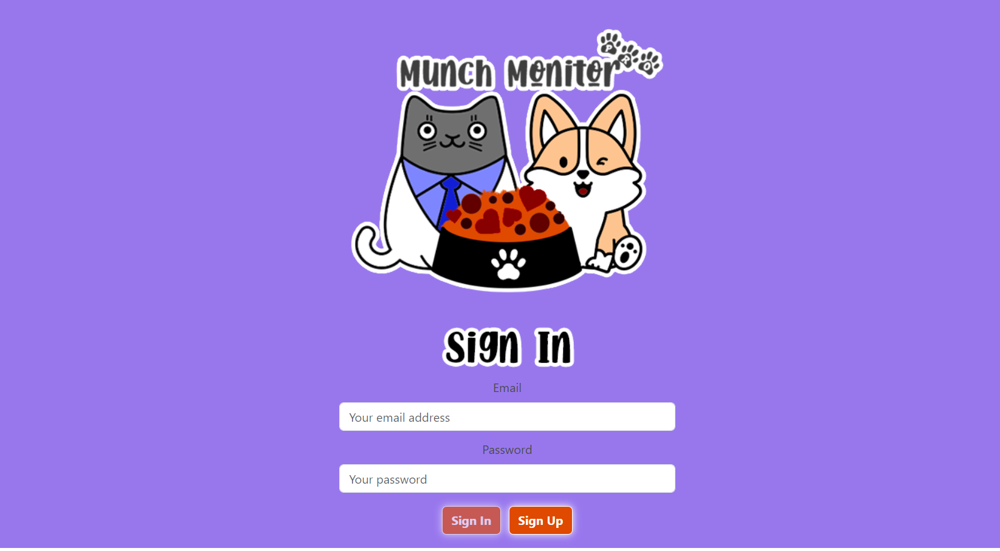
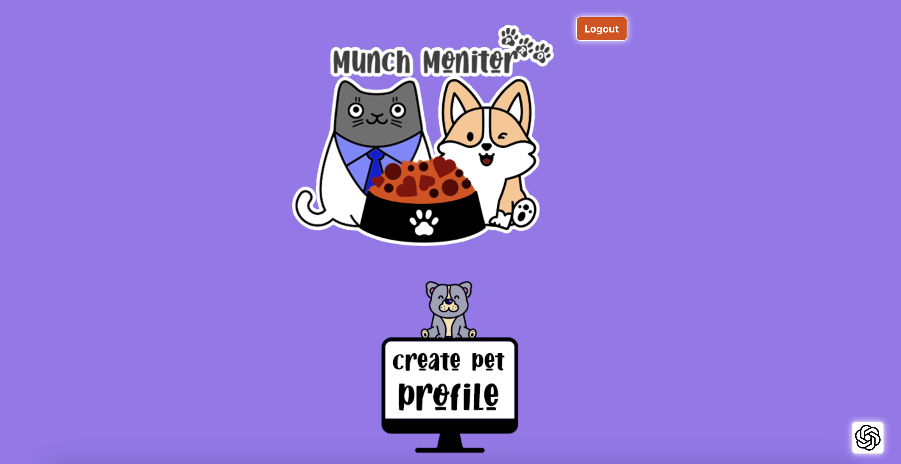
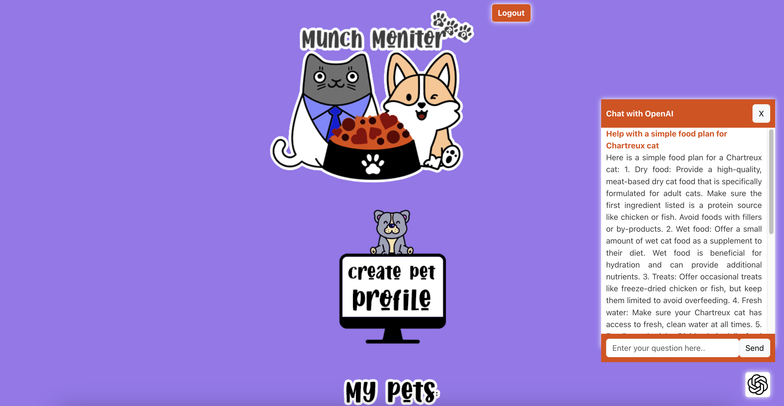
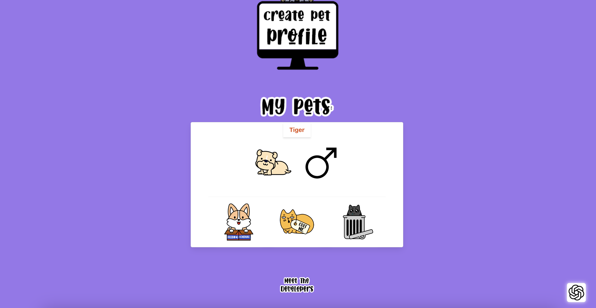
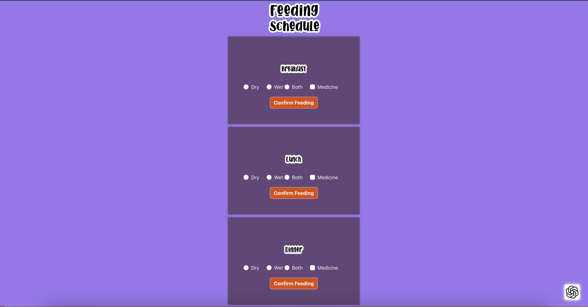

# Group Project: munchMonitorPro
munchMonitor Pro is a sophisticated MERN (MongoDB, Express.js, React, Node.js) full-stack application designed to help pet owners meticulously track and manage their pets' daily intake and medication schedules. With a user-friendly interface and robust backend, the application ensures that pet care is both efficient and effective.

### New Feature
- Users can now interact with an AI-powered chatbot directly within the application.
- Ask questions and get suggestions related to pet care, dietary needs, and health tips.
- Receive instant, intelligent responses tailored to specific inquiries, enhancing the user experience and providing valuable insights.

## Description
This application allows users to create an account in the portal and create, edit, or delete pet profiles. The feed scheduler allows the user to keep track of the food and medicine. The application handles all the user requests or CRUD operations through queries and mutations using GraphQL, Node.js, and Express.js. The application uses MongoDB to store the user information and authenticate the user through the JWT token. The application's front end is developed using React JS, React-Bootstrap, and Bulma CSS and deployed on the Render platform.

## Table of Contents
  - [Installation](#installation)
  - [Screenshots](#screenshots)
  - [Credits](#credits)
  - [License](#license)
  - [Deployment Link](#deployment-link)

## Installation
- To run or execute the application locally, install all libraries as mentioned under package.json.
- Necessary installation includes Node.js, Express.js, MongoDB Compass, VSCode, etc.

- To individually install the packages, use the below links,

- Follow the guidelines using the link to install Node.js: https://nodejs.org/en/learn/getting-started/how-to-install-nodejs,

- Follow the guidelines using the link to install Express.js: https://www.npmjs.com/package/express

## Screenshots
- The deployed application link: https://munchmonitorpro.onrender.com  

- The application source code link https://github.com/Vigneshwarie/munchMonitor

- Sample screenshots :
    - Screenshot of Front page 
    - Screenshot of Create Pet Profile 
    - Screenshot of ChatGPT Integration 
    - Screenshot of Display Pet Profile 
    - Screenshot of Display Feeding Schedule 

## Credits
- Team members:
  - Vigneswari Sambandam:  https://github.com/Vigneshwarie
  - Francisco Contreras: https://github.com/frankieee324 
  - Ricardo Torres: https://github.com/rtocastro
  - Tasneem Halim: https://github.com/thalim-glam 

## License
  

## Deployment Link
  -  https://munchmonitorpro.onrender.com 
